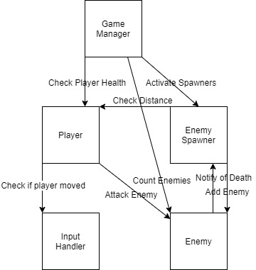
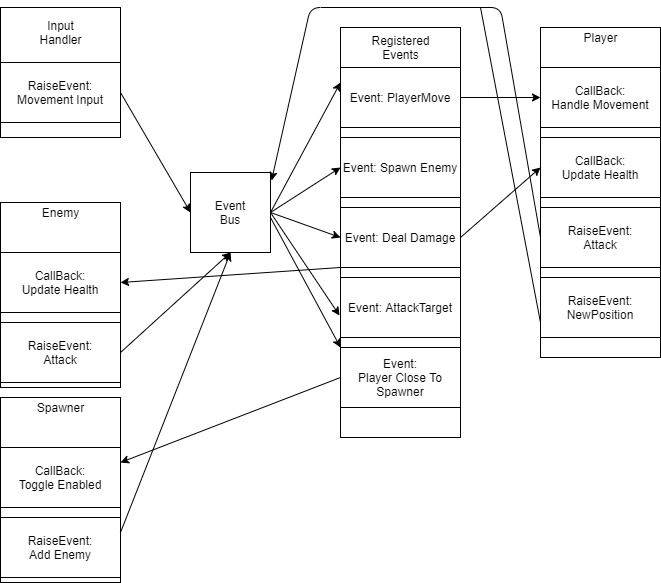

# Design Overview

## Component-Based Design

In this section I will give a quick overview of what a [Component-Based Design](https://en.wikipedia.org/wiki/Component-based_software_engineering) entails and try to motivate you as to why it is a good approach for game design. This type of design pattern is highly relevant in many different fields as it offers an extreme amount of extensibility to projects and allows for a modularity within a system that can allow for a robust and reliable solution. In game design it can be understood why this design pattern is useful, but when working in unity it can become very appealing to just link everything directly together and hope that changes further down the line don't mess things up. While this is okay for testing out new features and creating small pet applications, once extending past a simple proof of concept it can prove to be a large head ache to stay organized when combining new features. Thus we enter into a strict component based design.   

Without a component based system we would end up having to strongly link all of are different parts of the program together. Since they are strongly linked this would mean that refactoring and changing a system would be a large undertaking as every system that relies on or interacts with that system would have to have it's code modified to adapt to a new interface or the deprecation of an interface that is being replaced with something more effecient. This would leave a quandry of having to decide if the time investment to refactor a system is worth any sort of benefit that the refactoring will have. This is shown by the diagram of a strongly linked system below.

As we can see from even a simple system, if we strongly link every piece of data and system we end up with a mess of dependencies that reduce reliability and increase frustration in debugging and modifying code. Now we will take the opposite approach to try and solve these issues and introduce a diagram that shows an application built using loosely coupled systems in a proper component-based design.  

   

Now I am sure looking at this for the first time you are thinking "How the hell is this a better system...", But if you take the time to really look at what is happening you will notice something special that routing data like this using events does. Instead of a system relying on another system it just does it's job until a new event arrives for it to handle. This means that we can have many discrete Systems that have their responsibilities factored in such a way that they are only ever concerned with doing one things. This makes finding issues arrising in a given system a much more trivial task. As well this means that, since a system just waits for a message to be sent via the event bus, it doesn't matter if we replace all of the code at a system as long as it listens for the events it needs to! This is great for reliability and maintaining a system when it grows up to be bigger.  

This is the core concept that this project is architected around. Each system has a  **single** responsibility to deal with, for example the input system will only care about listening to the keyboard and pushing an event along to the bus once an input is recieved. It doesn't care which systems want or need that event it's only job is to tell the system that the event has occured and any system that requires that event will be listening and parse the data in the event to carry on with their job.  

This is just an introduction to Component Based Design and I am by no means an expert but I hope this will give you a jumping off point to begin understanding the design of the project and knowing what to look up and research should you want to learn more about this design pattern. The concept is actually fairly simple if you think about it in the sense of a bunch of servers that consume data requests and spit back a response, however in practice things can get a bit trickier as it is difficult to maintain a completely decoupled system and there are a few ugly bits of C# needed in-order to fully actualize the system. The next section will cover the intricicies of actually implementing and working within the system.   

## Event System  

An offset of decoupling systems is that we still need a practical means of getting information around the system, enter the Event System. These are very common in many different applications and allow for a way to organize and keep synchronized during asyncronous systems, such as a GUI system that cannot freeze everytime it processes a users interaction and would rather use events to pass work off to different threads. In a way an event system is similar to using a queue in a producer consumer problem.  

### Event Bus  

This is the core of the event system. The event bus supplies the whole application a common access point for sending and recieving messages. The idea is that all messages should be centralized, as any decentralization of event processing would result in a loss of loose coupling in the over all application. As such we will be sending all data through the event bus and the event bus will handle remembering which systems are awaiting which events and properly and quickly routing data. Another benefit of this is that if we need to log all the events happening in a system to discover which event is causing an error we have an easy access point to log from to create a history of what is happening in the system.  

### Subscribing or Registering  

When an event requests to be invoked when an event is raised is commonly called subscribing to an event or registering to an event. This basically means that during system setup, the given system will notify the event bus of the function it wants to associate with a given event and then leaves the rest to the event bus to actually trigger the event when the event is raised. It is important to note that at the same time, we must be careful that all dead events are deregistered inorder to avoid creating an unneeded search of the event list looking for events to raise that are no longer relevant.   

### Raising Events  

Raising events is the common name for when some system wants to trigger another system or pass data to another system. Basically just means that at some point in the code there is a call made to the event bus telling it that a given event should be triggered and all subscribers should be notified so they can have their associated functions called to complete whatever task is needed.  

## C# Delegates and practical implementation   

One of the hurdles to overcome with an event based system is how do we actually associate logic and functionality with an abstract concept like an event being raised. This might seem like a tricky answer but to anyone who has experience programming you have probably come across at least one or two language features that are commonly used for event systems. If you have ever heard of a **Call Back** you are already halfway to understanding how an event system is implemented. There are two great examples that come to mind when considering an event system implementation.  

- C, Function Pointers
	Although you may not have ever really used these, in practice they are just a way for use to pass around a function as if it was a parameter so other functions can access the symbol   
- Javascript, Function Objects  
	This one comes up A LOT in the world of JS, basically this is when you call a function but pass it in a function as a parameter and it gets called by the first function when it is done it's job. Commonly used in asynchronous tasks such as a callback from an ajax call   
- C#, Delegates   
	These are what we are most interested in, if you havn't heard of them before I will briefly go over them but I suggest reading the documentation as well since I cannot fully go over them here   

The concept of a call back is to pass functionality to a function which will finish it's job and eventually invoke the function it is told to. This is a powerful concept as it allows for very complex asynchronous calls that depend on one function finishing before the other. In our case however we will just be using this feature to associate a function with an event without the event bus needing to ever actually know anything about the function besides from it fitting the mould for an event call back. We will be using delegates to achomplish this, they are essentially an extension of function pointers from C but aimed towards an object oriented workflow in C#.  

### C# Delegates

Delegates are simple in design yet complex in practice. There is a primitive type in C# called a delegate and you can create one at any point in a script. What this does is make a "blueprint" for what kind of functions can be associated with the delegate, thus any functions added to the delegate need to have the same parameters and return type as the delegate they want to attach to. This means that we can simply pass a function we want called on an event raise to the event bus and then without any knowledge of the system waiting for the event invoke the function to let the system process the event. Another neat thing about delegates that becomes very important is the idea that they can reference multiple functions. This means if for example each enemy subscribes to the same "GameOver" event or another such event when the "GameOver" event gets raised it will invoke every single function that attached itself to the delegate. This can be useful for events that might span multiple systems.  

### Unity Actions  

In unity there is already a built in delegate that can be used to easily pass around functionality. They are called unity actions and serve as a way for unity to share actions in the editor allowing for dynamically adding and modifying functionality. In our case we will be using a special type of unity action as we also want to be passing a dictionary of parameters to the event so we can move data along in the system as well. As such when subscribing to events we will be structering our call back functions to fit the naming convention put forth by the delegate we want to associate with. In the "Using The Event System" feature guide there will be steps to going through and practically implementing features that interact with this system.  

## Summary   

The big take away is that we will be using a component based design, which in our implementation will require us to use C# features like delegates to properly track and trigger events as needed. This way we can keep different systems as seperate as possible while still allowing data to freely flow in the system. Every effort should be made to keep systems as singular and focussed as possible and to avoid hard linking of dependencies as much as able to maintain the ability to swap out and improve systems as needed.  

If you have any questions feel free to reach out to me after doing some research and I will be more than happy to help you figure things out, after reading this section a strong place to go next would be the "Event System Feature Guide" which will walk you through the specifics of our implementation of the event system and get you up and working in it as quickely as possible.  

Thank you for reading :)
