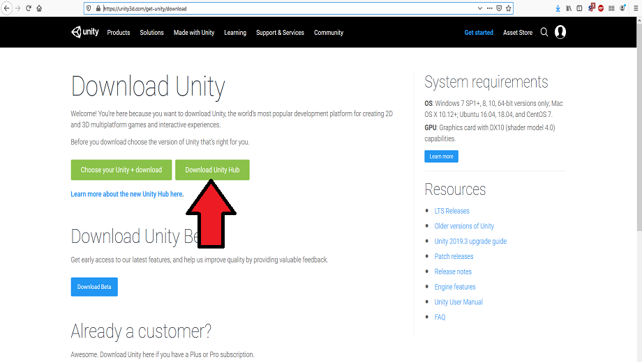
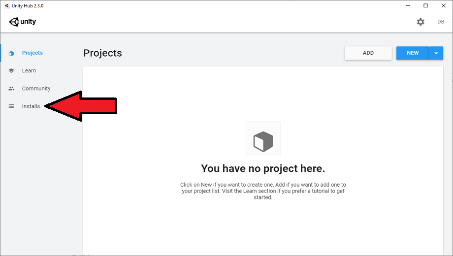
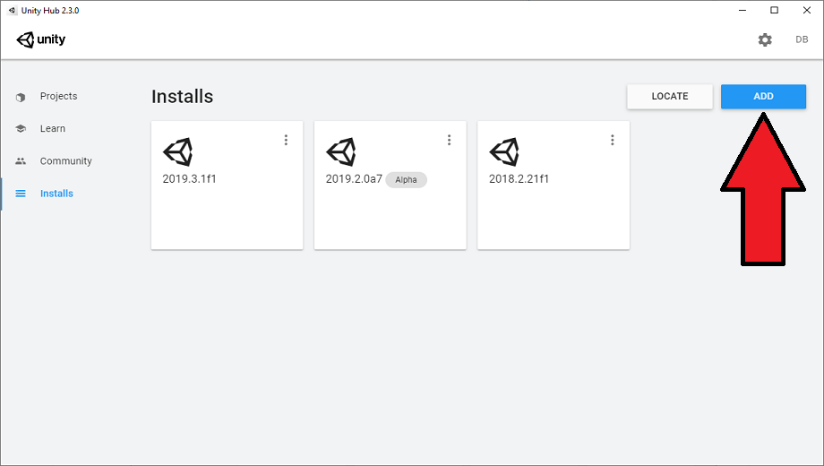
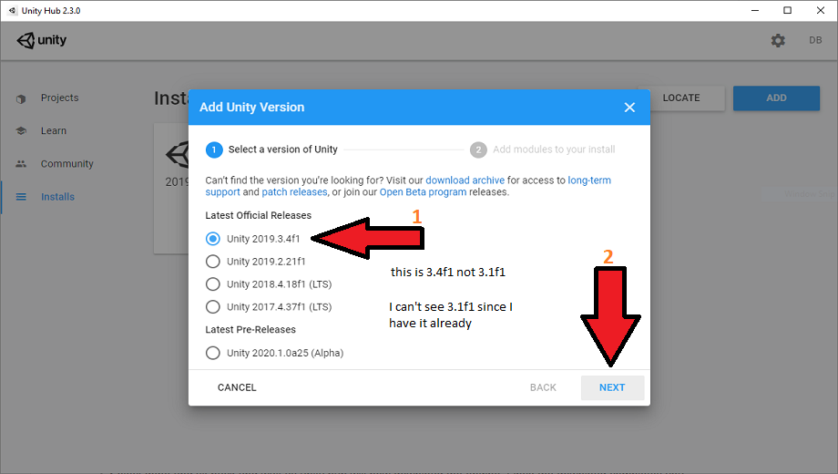
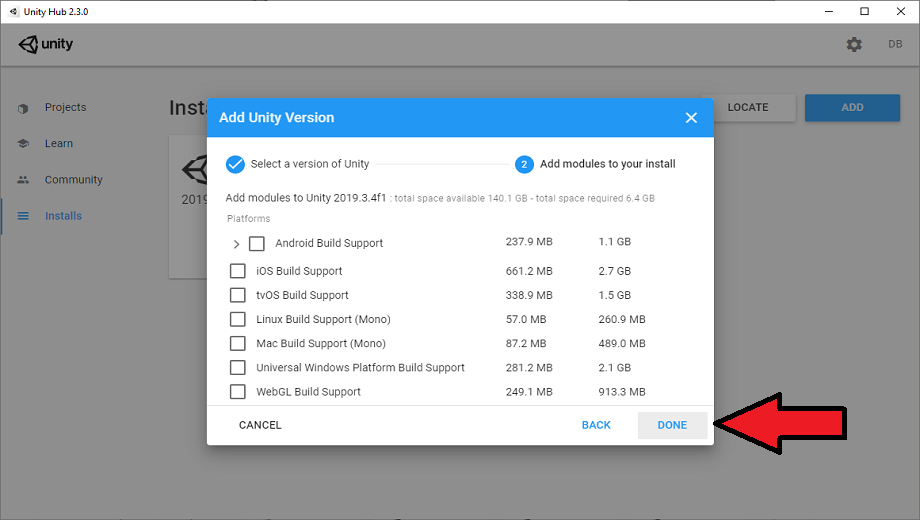
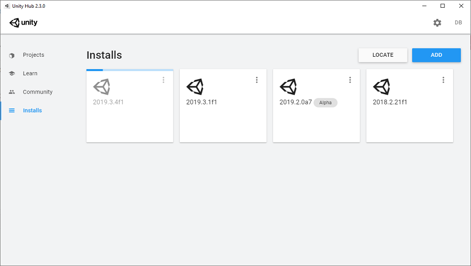
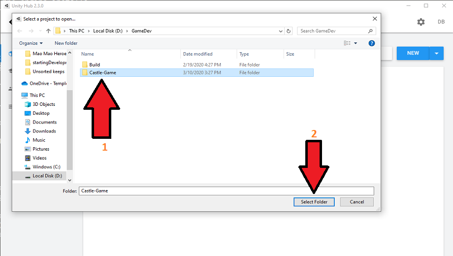
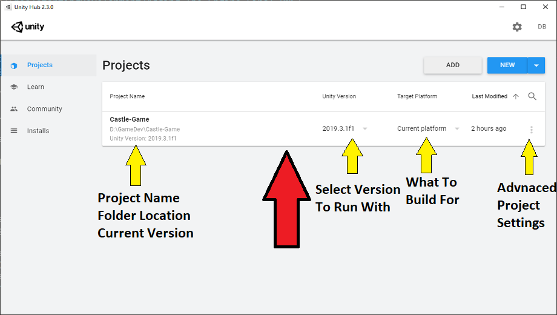
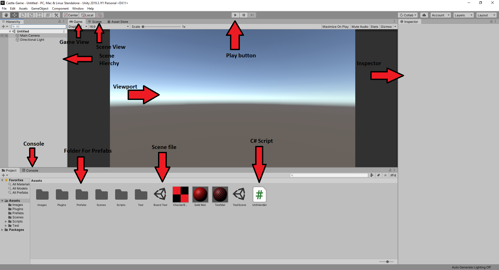

# Guide for First Time Setup of Castle Game

## Setting up unity

Before you can begin to work on any game you must first get the engine you are going to be using.
For castle game the engine of choice is unity, the reason for this decision is it is a relatively user friendly engine and offers many great features while still being approachable by those without a lot of experience in game design. To get unity set up is very straight forward and does not require a great deal of work. Below will be a list of the steps that need to be taken to get set up with the engine.

### Setting Up An Account

A prerequisite to using unity is having a unity developer account. Unity is commercial software so while it is free to use as long as you are not breaching the limitations of the user agreement, you still need to be registered with them. You can choose either a student or personal account, it doesn't really matter as this project does not use any of the features found in higher tier versions of unity. Some of these features can be useful but I have never really found them to be a limiting factor in creating a project in unity so unless you don't qualify these accounts will be more then enough for most projects.    
   
The account setup can be found [on this page](https://store.unity.com/#plans-individual) I won't be going over it extensively as it should be straight forward.

### Getting The Engine

1. Download unity 
    You can find the download page [here](https://unity3d.com/get-unity/download). Simply click download unity hub and you are on your way.  
         

    *The reason I say unity hub is it will provide the same service as the stand alone engine but allows multiple engines incase versions change. You can use the stand alone engine but be wary of tracking what version of the engine you downloaded.*    

2. Install unity hub
    Just like any other application you install simply run the installer and it will handle the rest for you
    
3. Get the actual engine through unity hub
    - Once you have unity hub set up open the install tab   
         

    - Click the add button to bring up the interface showing available engine downloads   
    
    - Select the engine that has the version number you need    
       
    ***As of 3/10/2020 the version is 2019.3.1f1***   
    *Check the readme if you want to check for updates to the version being used however, there is a low chance that engine version will impact stability in a severe manor as long as it is close and optimally newer then the current version*    

    - Click next and select any required modules.    
        
    **No modules are required for castle-game currently, but they at worst just take up some hard disk space**
    - Select done and sit back and wait as unity hub will now download the engine. Once the download completes you can move on to the next setup steps, or start them while the engine installs.   
    

## Getting the files

First thing to getting started in castle-games development is getting all of the files contained in the game. These files include asset files such as prefabs for game objects, scriptable objects for data handling, or C# scripts that create the logic. These will all be found in the git repository and should be straight forward to get. However I will add a small aside here about how to do it incase you need a refresher.

- Clone the git repository with the command ** git clone https://github.com/Dan-Burke-P/Castle-Game.git ** 
- Optionally (And how I prefer to do it for various reasons) is using git desktop. Simply click the clone button and enter in the repository link and select where you want to put your local copy.   

***As a thing to note about using git, sometimes you will create trash files when building the project or doing certain things which can clog up git, please keep track of what files you are adding to your commits and if you have a question about if a file is needed in the repo or not feel free to message someone else. I would prefer people slow down and ask rather then having to clean out the repo down the line***

## Running the project

Once you have all of the files you are ready to begin working with the project! First thing is first we need to add the unity project we just got with git to our unity hub so we can easily launch it, below will be steps that will walk you through setting your project location in unity hub all the way up to playing the game for the first time.

1. From unity hubs project page (The landing page when you launch it) click on the add button   

2. After clicking on add navigate to the folder created by git when you cloned the repository (it should be called "castle-game")

3. The project should now show up on your starting page in unity hub, simply click the game to run the project  
  
*Please note that in the bottom left corner shows the version listed in the project repo, essentially this is the current version of the project. in the unity version column there is a drop down where you can select which version you want to launch the game with. This can be useful if you are debugging an issue and suspect it is a version instability*
4. The editor should now open, that's all there is to it! now you can start working on the project

## Working Within Unity

The work flow is straight forward once you spend a few minutes adjusting to the enviroment and figuring out where important buttons and menus are. I will give a brief overview of how to work in unity but in reality the best way to learn if you are very new to unity is to just go to the unity learning resources find a tutorial project and work through it. From there you will learn the basics of working at unity and once you are up to speed and figure out some of the coding conventions it is easy to get into a mode where you are just coding instead of struggling with the unity engine interface. Below are the steps for basic script editing and running and building the game.

1. The explorer window shown in the picture will be where all the files in the project are located. it would be impossible for me to cover every single project file that can be contained there but I will list the key file types we will see  
    - Monobehaviours are C# scripts (Classes) that derive from the monobehaviour abstract class and provide event functions and other engine specific things (interface that let's the engine use the script in the game) 
    - scriptable objects are C# scripts that derive from a different abstraction and serve similar but different purposes (The same thing as monobehaviours but they are intended for data and don't function as game objects)
    - C# scripts can also be just raw C# and there are technically other abstract classes that can be derived from but that is situational and if it needs to be done is not difficult to figure out
    - scenes (The unity icon) are collections of objects in a hierchy and represent a state the game can be in, for example you could have a main menu scene which houses UI logic which when starting a game will load a play scene which has all the objects and logic required to run a game. They are strange at first but are not to bad once you get used to them
    - Prefabs are just serialized game objects that can be used as a template to create running instances of game objects
2. Viewport
    - The view port will show you the currently selected view you are looking for the two important viewports will be listed below
    - Play view shows you what the game will look like if you were to play it and will be displayed when you run the game in the editor
    - Scene view shows you the scene and lets you navigate around to design and layout objects you have put in the scene and can be looked at during play time to see things the camera cannot, also displays gizmos for editing objects that don't show in play mode
    - Scene Hierchy will show you all the objects in the scene and the order in which they are parented to eachother and can be used to edit the hierchy 
    - Inspector shows you the values of the selected object and allow you to edit the components and data related to the selection
    - Console shows you output from the game which can be sent manually with "Debug.Log("Message")" used for debugging purposes or any errors such as failing to compile
3. Playing the game
    - To play the game you can simply do it in the editor by pressing the play button, once you do that the game will start running in the scene you are in and switch to the play view. The pause and forward button lets you pause and move forward one frame at a time.
    - Once you press play you will get a stop button that will allow you to stop the game running in the editor
    - This is a great way for quickly testing things in the game but for finalizing tests and version you should always build the game which will be run over in the next section

    **Please note the folders and the way they are labeled and ordered, the naming conventions used in the project are listed in the conventions document.**  

       

4.  Building the game
    - under file select "build settings" or press ctrl + shift + B
    - in the build settings select all of the scenes that are required to play the game, note that you have to make sure you have the scene you want when the game is run at the top so it is the first scene loaded in, usually this will be the main menu scene
    - select target platform "windows" and architecture "x86_64", there are other options there that might sometimes be used but for now just select those option
    - click build and select the folder you want to place the final game in **Do not put it in the repo folder!**
    - Click select folder and the build process will begin
    - Once it is done you will have a stand alone game setup that you can run without unity or the editor, This is also how the final version will be built and shipped

## Final Remarks

Well that is everything! if you have any questions feel free to reach out and ask, the only stipulation is you should try to research the problem you are trying to solve first as the unity community is very large and likely there will be something you can adapt that will work for you.   
Make sure you are sticking to any conventions in the coding guide, comment your code, and make sure you are properly using the inline documentation that C# provides. You can see it in the code that already exists but there will also be a link to the official C# documentation page for anything that you might need to figure out.

